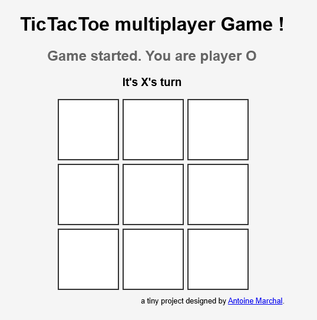
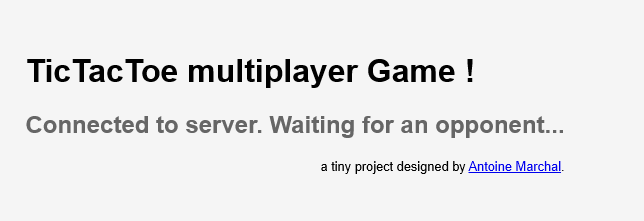
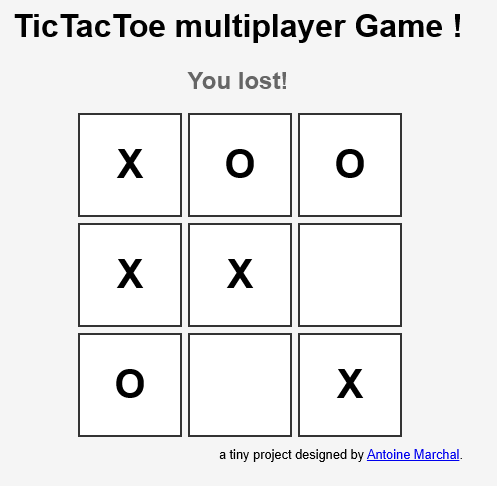
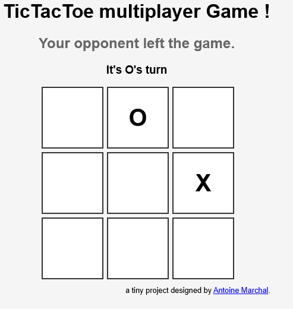

# Tic Tac Toe Multiplayer Game 🚀️

This project is a simple Tic Tac Toe game with multiplayer functionality, designed as part of my learning journey in React and Node.js. The game uses WebSocket for real-time interaction between players.

## Features

- **Multiplayer Mode**: Connects players in real-time using WebSocket.
- **Random Turn Selection**: The first turn is chosen randomly when the game starts.
- **Player Matching**: Automatically matches players when they log in, or adds them to a waiting list if no opponents are available.
- **React Frontend**: The user interface is built using React.
- **Node.js Backend**: The server is built with Node.js, Express, and WS.

## Installation

### Server Setup

1. Navigate to the `server` folder.
2. Install dependencies:

   ```bash
   npm install
   ```

3. Start the server:

   ```bash
   npm run dev
   ```

### Frontend Setup

1. Navigate to the `frontend` folder.
2. Install dependencies:

   ```bash
   npm install
   ```

3. Build the frontend:

   ```bash
   npm run build
   ```

4. The frontend will be served from the `frontend/build` folder.

### How to Play

- Log in to the game.
- If an opponent is available, you will be matched and the game will start.
- If no opponent is available, you will be added to a waiting list.

  

- The game ends when one player wins, or an opponent leaves.

  
  

### Contact

If you have any questions or feedback, feel free to contact me:

- Name : Antoine Marchal
- Email : [antoine.marchal@pm.me](mailto:antoine.marchal@pm.me)

---

This project marks the beginning of my learning path in React and Node.js.

Thank you for checking it out!
